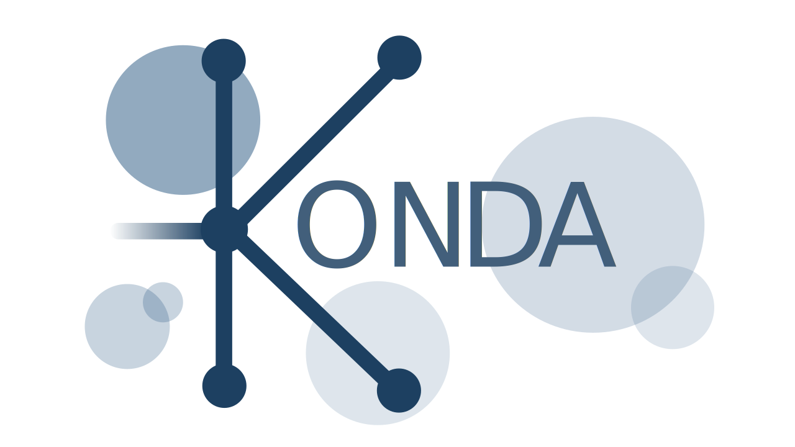
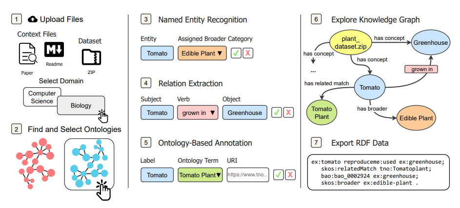
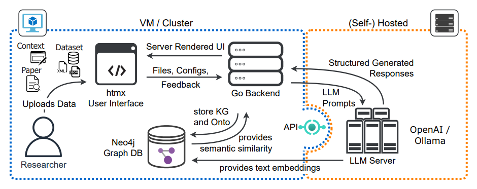
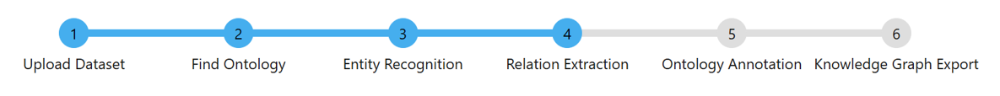

# KONDA

### An LLM‑based tool for semantic annotation and knowledge graph creation using ontologies for research data

<p align="left">
  
</p>

## Table of Contents

- [KONDA](#konda)
  - [Table of Contents](#table-of-contents)
  - [Project Overview](#project-overview)
    - [Workflow](#workflow)
    - [System Architecture](#system-architecture)
    - [Backend](#backend)
    - [Frontend](#frontend)
    - [Development Tools](#development-tools)
  - [Prerequisite for running the project](#prerequisite-for-running-the-project)
    - [Environment](#environment)
  - [Database Setup](#database-setup)
    - [Neo4j Setup](#neo4j-setup)
    - [Base DB Ontologies](#base-db-ontologies)
  - [Running the App](#running-the-app)
  - [Graph Visualization Integration (optional)](#optional-graph-visualization-integration)
  - [Development Guide](#development-guide)
    - [Remote Neo4j (optional)](#remote-neo4j-optional)
  - [How to Use KONDA](#how-to-use-konda)
  - [Citation](#citation)
  - [License](#license)
  - [Project Metadata](#project-metadata)

---

## Project Overview

KONDA is a web-based application designed to assist researchers in managing research data effectively. It leverages AI to extract metadata from datasets and papers, transforming them into structured knowledge representations like ontologies and knowledge graphs.

### Workflow

The following diagram illustrates the main processing pipeline of KONDA, from dataset upload to knowledge graph creation and RDF export.

<p align="middle">
  
</p>

### System Architecture

The following diagram illustrates the high-level architecture of KONDA, showing how the user interface, backend services, LLM providers, and the Neo4j graph database interact.

<p align="middle">
  
</p>

### Backend
- WebFrameworkRouter: Built-in `net/http` package
- ServerPort: configurable via `BACKEND_PORT` (default: `5050`)

### Frontend
- ReactivityLibrary: `htmx` with `Alpine.js`
- CSSFramework: `Tailwind CSS` with `daisyUI` components

### Development Tools
- Air: Live-reloading for Go applications
- NPM: Used for Tailwind CSS processing

---

## Prerequisite for running the project

Ensure that your system has the following installed:

- Go: Version `1.23` or later
- Node.js: Version `22.12` or later
- poppler: for the pdf2go lib
- Neo4j: Version `Neo4j 5.26.3` with plugins
- Git LFS: **Required** to fetch the Neo4j base database dump tracked in this repository


### Environment

Create a `.env` file based on the provided template:

```bash
cp .env.example .env
```

Then open the `.env` file and fill in the required configuration values according to your setup.

---

## Database Setup

This application relies on a properly configured Neo4j instance.

### Neo4j Setup

To set up Neo4j for KONDA:

1. Install Neo4j
   - **Option A – DozerDB**  
     - Visit: `https://dozerdb.org/`  
     - Follow the installation instructions for your system. DozerDB bundles Neo4j with the required plugins and configuration.
   - **Option B – Standard Neo4j Server**  
     - Visit: `https://neo4j.com/download`  
     - Install Neo4j 5.26.3 for your platform.

2. Enable Required Plugins
   Ensure the following Neo4j plugins are installed and enabled:
   - APOC
   - neo4j-genai-plugin
   - neosemantics (n10s)

   Do not forget to add the following settings to your `neo4j.conf` (Neo4j 5.x) to enable the RDF HTTP endpoint and allow required procedures:

   ```ini
   # n10s RDF HTTP endpoint (this app calls /rdf/...)
   server.unmanaged_extension_classes=n10s.endpoint=/rdf

   # Allow http requests to these endpoints
   dbms.security.http_auth_allowlist=|/|/browser.*|/db/.*|/rdf/.*

   # Allow plugins
   dbms.security.procedures.allowlist=apoc.*,n10s.*,genai.*
   dbms.security.procedures.unrestricted=apoc.*,n10s.*,genai.*
   ```
3. Load Base Database Dump
   - This repository includes the BaseDB dump at `dump/basedb.dump` (tracked via Git LFS).
   - If Git LFS is not installed on your system, install and initialize it with:
     ```sh
     git lfs install
     ```
   - After cloning the repository, download the database dump with:
     ```sh
     git lfs pull
     ```
   - Stop Neo4j and load the dump (Neo4j 5.x):
     ```sh
     neo4j-admin database load basedb --from-path="<PATH_TO_REPO>/dump" --overwrite-destination=true
     ```
   - Start Neo4j
     ```sh
     neo4j console
     ```
> ⚠️ Make sure your Neo4j instance is running and the database is accessible using the credentials provided in the `.env` file.


### Base DB Ontologies
This is a list of the generic ontologies used in the BaseDB:

aeon.owl - dcat3.ttl - euroscivoc.owl - gfo.owl - modsci.owl - prov.ttl - ro.owl - skos.rdf - bfo.ttl - dcterms.ttl - fair.owl - gist.owl - oboe-core.owl - rdf.ttl - sepio.owl - stato.owl - bibo.ttl - dpv.ttl - foaf.rdf - gpo.owl - owl.ttl - rdfs.ttl - sio.owl - vcard.ttl - cc.rdf - edam.owl - geo.ttl - m4i.owl - premis3.owl - reproduce-me.owl - sioc.rdf - xsd.xml

---

## Running the App

1. Install Node.js dependencies:
   ```sh
   npm install
   ```

2. Build the frontend:
   ```sh
   npm run build
   ```

3. Build the project:
   ```sh
   go build -o ./konda .
   ```

4. Run the application:
   ```sh
   ./konda
   ```

5. Open a browser and go to `http://localhost:5050` (or the port set in your `.env`).

---

## Optional: Graph Visualization Integration

KONDA can visualize the generated knowledge graph interactively. You can integrate **any** graph visualization library you prefer.

> ⚠️ NVL was originally intended as the default graph visualizer. Since this project is published under GPLv3, it cannot be redistributed together with NVL (`@neo4j-nvl/*`).

> ⚠️ If you redistribute this project, do not bundle or ship NVL with the GPLv3-licensed code.

If you have the proper license, you can enable the NVL-based visualization locally as follows:

1. **Install the NVL packages locally**

   ```sh
   npm install @neo4j-nvl/base @neo4j-nvl/interaction-handlers
   ```

   These packages, and their transitive dependency `@neo4j-nvl/layout-workers`, are subject to Neo4j’s proprietary license. Do **not** redistribute them as part of a GPLv3 release of this project.

2. **Re-enable the NVL imports in `web/scripts.js`**

   In `web/scripts.js`, locate the commented lines near the bottom and uncomment them:

   ```js
   // window.neo4jNVL = require("@neo4j-nvl/base");
   // window.neo4jNVLInteraction = require("@neo4j-nvl/interaction-handlers");
   ```

3. **Re-enable the NVL script in `view/pages/knowledge-graph.html`**

   In `view/pages/knowledge-graph.html`:

   - Inside the `{{ define "scripts" }}` block you will find a `<script type="module">` whose entire body is wrapped in a block comment and starts with:

     ```js
     // NVL usage
     /* let nvlInstance = null;
        document.addEventListener("DOMContentLoaded", fetchAndDisplayGraphData);
        document.addEventListener("tasks-complete", fetchAndDisplayGraphData);
        ...
     */
     ```

   - Remove the surrounding `/*` and `*/` so that the NVL-related JavaScript executes again.

4. **Restore the NVL graph container markup**

   In `view/pages/knowledge-graph.html`, uncomment the HTML block labelled `NVL container` and remove/adjust the “visualization is disabled” placeholder.

   Optional: also uncomment the Help bullets (HTML comment) to restore NVL-specific interaction/color guidance.

5. **Rebuild the frontend**

   After making these changes, rebuild the frontend so Parcel picks up the NVL dependencies:

   ```sh
   npm run build
   ```

At this point, the interactive NVL-based visualization should render again.

---

## Development Guide

For development, use `Air` to automatically reload the project when changes are detected.

> Please make sure that you have installed the executable files for all the necessary tools before starting your project:
> 
> - `Air`: [https://github.com/air-verse/air](https://github.com/air-verse/air)

Start the Neo4j DB:
   ```sh
   NEO4J_HOME/bin/neo4j console
   ```

To start live-reloading development mode, run:
   ```sh
   air
   ```

Visit port `5050` to access the app. For auto-reload on save in your browser, visit port `5051`.

### Remote Neo4j (optional)

If your Neo4j runs on another machine, set `NEO4J_DB_URL` and `NEO4J_HTTP_URL` accordingly (or use an SSH tunnel that forwards `7474` and `7687` to your local machine).

---

## How to Use KONDA

<p align="center">
  
</p>

The tool is a pipeline of six steps.

1. **Upload Dataset**: Upload your data files and optional context documents (e.g. PDFs); set domain if needed.
2. **Find Ontology**: Search and select ontologies to load into Neo4j for annotation and mapping.
3. **Entity Recognition**: LLM-extracted or manual entities; add, edit, or remove as needed.
4. **Relation Extraction**: LLM-extracted or manual relations between entities.
5. **Ontology Annotation**: Map entities/categories to ontology terms (URIs) from the selected ontologies.
6. **Knowledge Graph Export**: Inspect the graph and RDF, then export (Turtle, RDF/XML, or JSON-LD). Use Back to re-run from an earlier step if needed.

---

## Citation

If you use KONDA in your research or application, please cite the following paper:

> [1] S.-Y. Kim, M. Görz, and S. Geisler, “KONDA: An LLM-based Tool for Semantic Annotation and Knowledge Graph Creation Using Ontologies for Research Data,” in *Proc. 5th Int. Workshop on Scientific Knowledge: Representation, Discovery, and Assessment (Sci-K)*, Nara, Japan, CEUR-WS.org, Nov. 2025. DOI:10.18154/RWTH-2026-04351

A formal citation file is included as `CITATION.cff` for automated reference managers and repositories.

---

## License

This project is licensed under the GNU General Public License v3.0 (GPL-3.0).  
See the `LICENSE` file for the full license text.

---

## Project Metadata

- **Title**: KONDA
- **Description**: An LLM-based tool for semantic annotation and knowledge graph creation using ontologies for research data.
- **Keywords**: semantic annotation, knowledge graphs, ontologies, research data management, large language model
- **Authors**: Martin Görz, Data Stream Management and Analysis Group (RWTH Aachen University)
- **Repository Created On**: 20 April, 2026
- **License**: GNU GPLv3
