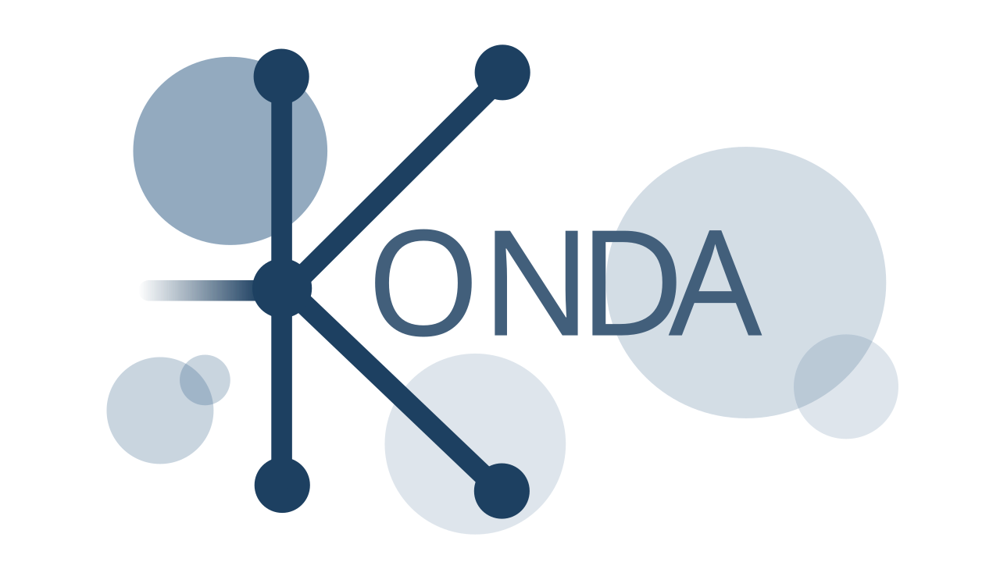
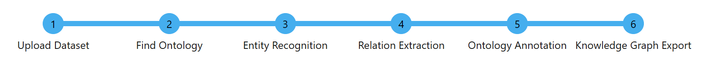
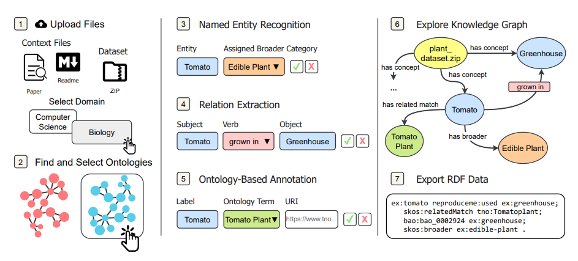
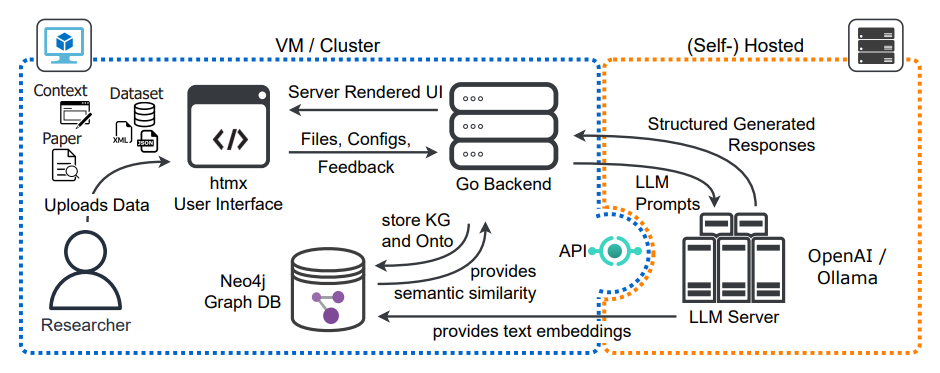

# KONDA

**An LLM-based tool for semantic annotation and knowledge graph creation using ontologies for research data**

<p align="center">
  
</p>

KONDA is an open-source web application that helps users to turn datasets and supporting documents into structured, machine-readable knowledge. It guides you from uploaded files to an ontology-linked knowledge graph whose contents you can review and refine before exporting them in standard RDF formats.

You do not need to be an ontology expert to use the guided workflow. KONDA can suggest entities, relationships, and ontology terms with a large language model (LLM), while keeping you in control of every result.

> ⚠️ **Important:** KONDA does not include or provide access to an LLM. The current implementation uses Azure OpenAI and must be connected to your own deployment. API keys, usage costs, and provider terms remain your responsibility.

## Contents

- [Why use KONDA?](#why-use-konda)
- [How KONDA works](#how-konda-works)
- [Supported input formats](#supported-input-formats)
- [Demo video](#demo-video)
- [Getting started](#getting-started)
- [Technical overview](#technical-overview)
- [Interactive graph visualization (optional)](#interactive-graph-visualization-optional)
- [Development (optional)](#development-optional)
- [Citation](#citation)
- [License](#license)
- [Project metadata](#project-metadata)

## Why use KONDA?

Research information is often spread across datasets, reports, and domain-specific documents. KONDA helps turn these materials into structured, machine-readable knowledge whose meaning is explicitly described.

With KONDA, you can:

- **Make research data easier to understand and reuse:** describe data using clearly defined concepts and relationships.
- **Reduce manual annotation work:** use AI-generated suggestions to speed up the annotation process.
- **Use terminology from your research domain:** link your data to terms from shared ontologies so that its meaning is clearer to other researchers and software tools.
- **Create interoperable results:** export RDF in widely supported formats for use in other tools, repositories, and data pipelines.
- **Keep control of your infrastructure:** run the application locally and connect it to your own Azure OpenAI deployment and local or remote Neo4j instance.

KONDA follows a human-in-the-loop approach: AI-generated suggestions assist the annotation process, but users decide what becomes part of the final knowledge graph.

## How KONDA works

<p align="center">
  
</p>

KONDA guides you through six steps:

1. **Upload Dataset:** add one dataset and at least one context file, such as a paper or description of the data. You can also specify the research domain and add your own notes in the text box.
2. **Find Ontology:** search for relevant ontologies or upload your own. You can also continue without selecting a domain-specific ontology; KONDA can still use the generic ontologies included in its base database when suggesting annotations.
3. **Entity Recognition:** inspect the entities suggested by the LLM, then add, edit, or remove them as needed.
4. **Relation Extraction:** specify how the entities are connected, using AI suggestions, manual editing, or a combination of both.
5. **Ontology Annotation:** check and refine the suggested mappings to ontology terms, or add your own.
6. **Knowledge Graph Export:** inspect the generated RDF and download the knowledge graph as Turtle, RDF/XML, or JSON-LD.

You can return to an earlier step whenever you need to revise the result.

### Workflow at a glance

<p align="center">
  
</p>

## Supported input formats

**Dataset:** upload a single `.zip` archive (maximum 500 MB). Inside the archive, KONDA can extract text from:

- plain text (`.txt`) and Markdown (`.md`)
- CSV (`.csv`) and TSV (`.tsv`)
- JSON (`.json`)
- PDF (`.pdf`)
- Word and OpenDocument text (`.docx`, `.odt`)
- spreadsheets (`.xlsx`, `.ods`)
- presentations (`.pptx`, `.odp`)

**Context documents:** upload one or more files. Accepted extensions: `.pdf`, `.docx`, `.txt`, `.odt`, `.md`, `.pptx`, `.odp`. Do not use legacy `.doc`; use `.docx` or `.odt` instead.

**Ontology files:** accepted extensions: `.owl`, `.xml`, and `.ttl`.

## Demo video

Watch the [KONDA demonstration video](https://www.youtube.com/watch?v=7KA0dFhi_os) to see the complete workflow.

## Getting started

The steps below are intended for the person installing KONDA. Once the application is running, users interact with it through the browser-based workflow described above.

### Requirements

Install the following software before continuing:

- [Git](https://git-scm.com/) and [Git LFS](https://git-lfs.com/)
- [Go](https://go.dev/doc/install) 1.23 or later
- [Node.js](https://nodejs.org/) 22.12 or later
- [Poppler](https://poppler.freedesktop.org/) for extracting text from PDF files
- Neo4j 5.26.3 with the required plugins: APOC, GenAI, and neosemantics (n10s)
- An Azure OpenAI chat deployment and embedding deployment

### 1. Clone the repository

```sh
git clone https://github.com/dsma-org/konda.git
cd konda
git lfs install
git lfs pull
```

Git LFS is required because the base Neo4j database dump is stored at `dump/basedb.dump`.

### 2. Configure the environment

Create a local environment file from the template:

```sh
cp .env.example .env
```

Open `.env` and fill in the values described in `.env.example`. You will need to configure:

- the application port (optional; defaults to `5050`);
- Azure OpenAI for the chat-based steps (API key, endpoint, and model deployment);
- Neo4j GenAI settings for embeddings (Azure resource and embedding deployment); and
- Neo4j credentials plus the Bolt and HTTP connection URLs.

Do not commit `.env` or expose the credentials it contains.

### 3. Set up Neo4j

KONDA requires Neo4j 5.26.3, support for multiple databases, and the following plugins:

- APOC
- Neo4j GenAI
- neosemantics (n10s)

Choose one of the following setup options:

#### Option A: DozerDB distribution

Download and install the DozerDB distribution. It already includes Neo4j Community and the DozerDB plugin, which provides the multi-database functionality required by KONDA. Therefore, you do not need to install Neo4j separately.

However, the APOC, GenAI, and neosemantics (n10s) plugins must still be installed separately.

#### Option B: Existing Neo4j installation

Use a compatible Neo4j 5.26.3 installation that supports multiple databases. Install the APOC, GenAI, and neosemantics (n10s) plugins separately.

#### Configure Neo4j

After completing either option, add the following settings to `neo4j.conf`.

If you use the DozerDB distribution, open the `conf/neo4j.conf` file inside the extracted DozerDB directory.

```ini
# Enable the n10s RDF HTTP endpoint used by KONDA
server.unmanaged_extension_classes=n10s.endpoint=/rdf

# Allow requests to the required HTTP endpoints
dbms.security.http_auth_allowlist=|/|/browser.*|/db/.*|/rdf/.*

# Allow the plugin procedures used by KONDA
dbms.security.procedures.allowlist=apoc.*,n10s.*,genai.*
dbms.security.procedures.unrestricted=apoc.*,n10s.*,genai.*
```

Make sure Neo4j is stopped before loading the included base database:

```sh
neo4j-admin database load basedb --from-path="<PATH_TO_REPOSITORY>/dump" --overwrite-destination=true
```

Then start Neo4j:

```sh
neo4j console
```

Make sure the `basedb` database is available and that the Neo4j credentials and connection URLs match the values in `.env`.

#### Remote Neo4j (optional)

You can skip this section if Neo4j and KONDA are running on the same machine.

If Neo4j runs on another machine, set `NEO4J_DB_URL` and `NEO4J_HTTP_URL` in `.env` to point to the remote instance. Alternatively, use an SSH tunnel that forwards the Neo4j HTTP and Bolt ports (`7474` and `7687`) to your local machine.

### 4. Build and run KONDA

Install the frontend dependencies and build the application:

```sh
npm ci
npm run build
go build -o konda .
```

Run the application:

```sh
./konda
```

Open [http://localhost:5050](http://localhost:5050) in a browser. If you changed `BACKEND_PORT` in `.env`, use that port instead.

## Technical overview

<p align="center">
  
</p>

KONDA is a locally run web application with the following main components:

| Area | Technology |
| --- | --- |
| Backend | Go 1.23, using the standard `net/http` package |
| User interface | HTML templates, htmx, and Alpine.js |
| Styling | Tailwind CSS and daisyUI |
| AI-assisted processing | Azure OpenAI |
| Graph storage and RDF processing | Neo4j with APOC, GenAI, and neosemantics |
| Frontend build | Node.js, npm, and Parcel |
| Development reload | Air |

### Base database

The included `basedb` dump contains generic ontologies that KONDA can use when suggesting annotation terms. The dump is tracked with Git LFS and contains resources from vocabularies including BFO, DCAT, Dublin Core Terms, DPV, EDAM, FOAF, GFO, GIST, GPO, MODSCI, OBOE, OWL, PROV-O, RDF, RDFS, RO, SIO, SKOS, and XSD.

## Interactive graph visualization (optional)

KONDA always lets users inspect the generated RDF and export the knowledge graph. Interactive graph visualization is optional and is not included in the GPLv3 distribution.

NVL (`@neo4j-nvl/*`) was originally used for interactive visualization, but it is distributed under a license that is not compatible with bundling it into this GPLv3 repository.

> ⚠️ **License notice:** Do not redistribute NVL packages with KONDA. If you have the appropriate license, you may enable them locally:

1. Install the packages without committing them to the project:

   ```sh
   npm install @neo4j-nvl/base @neo4j-nvl/interaction-handlers
   ```

2. In `web/scripts.js`, uncomment the NVL imports near the bottom of the file:

   ```js
   // window.neo4jNVL = require("@neo4j-nvl/base");
   // window.neo4jNVLInteraction = require("@neo4j-nvl/interaction-handlers");
   ```

3. In `view/pages/knowledge-graph.html`, remove the block comment around the NVL code in the `scripts` template.

4. In the same file, restore the HTML block labelled `NVL container` and remove or adjust the visualization-disabled placeholder. You may also restore the commented NVL help text.

5. Rebuild the frontend:

   ```sh
   npm run build
   ```

## Development (optional)

You can skip this section if you only want to install and use KONDA.

This section is intended for developers who want to modify the source code. KONDA supports [Air](https://github.com/air-verse/air), which automatically rebuilds and restarts the application when source files change, instead of requiring you to run the build commands manually after every change.

Install Air and make sure Neo4j is running. Then start the development environment with:

```sh
air
```

The application is available on port `5050`. Air's browser proxy is available on port `5051` and automatically reloads the page after a successful rebuild.

## Citation

If you use KONDA in research or another application, please cite:

> S.-Y. Kim, M. Görz, and S. Geisler, “KONDA: An LLM-based Tool for Semantic Annotation and Knowledge Graph Creation Using Ontologies for Research Data,” in *Proceedings of the 5th International Workshop on Scientific Knowledge: Representation, Discovery, and Assessment (Sci-K)*, Nara, Japan, CEUR-WS.org, November 2025. DOI: [10.18154/RWTH-2026-04351](https://doi.org/10.18154/RWTH-2026-04351)

A machine-readable citation is available in `CITATION.cff`.

## License

KONDA is licensed under the [GNU General Public License v3.0](LICENSE). See `LICENSE` for the full terms.

## Project metadata

- **Title:** KONDA
- **Description:** An LLM-based tool for semantic annotation and knowledge graph creation using ontologies for research data
- **Keywords:** semantic annotation, knowledge graphs, ontologies, research data management, large language models
- **Authors:** Martin Görz and the Data Stream Management and Analysis Group, RWTH Aachen University
- **Supervisor:** Soo-Yon Kim
- **Repository created:** 20 April 2026
- **License:** GNU GPLv3
